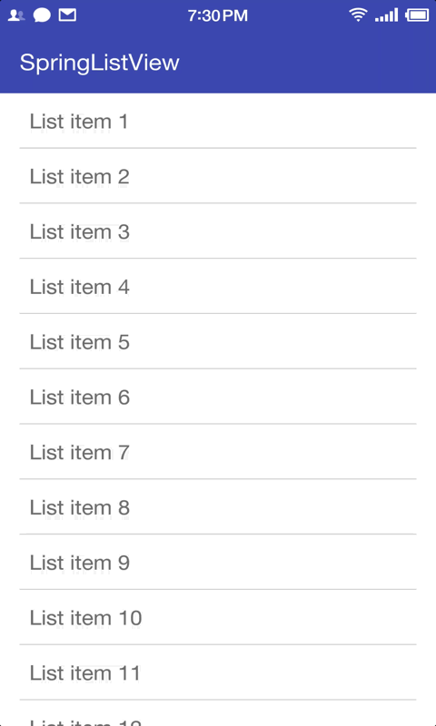

# SpringListView

SpringListView is a ListView with spring effect when being dragged or flinged to overScroll.

RecyclerView Version: https://github.com/gjiazhe/SpringRecyclerView

## Screenshot



## Include SpringListView to Your Project

With gradle:

```groovy
dependencies {
   compile 'com.gjiazhe:springlistview:1.1'
}
```
## Use SpringListView in Layout File

```xml
<com.gjiazhe.springlistview.SpringListView
        android:id="@+id/spring_list_view"
        android:layout_width="match_parent"
        android:layout_height="match_parent"
        app:slv_enableSpringEffectWhenDrag="true"
        app:slv_enableSpringEffectWhenFling="true"
        app:slv_flingBackAnimDuration="300"
        app:slv_releaseBackAnimDuration="300" />
```

## Description of Attributes
|           Attributes            | Format  | Default |               Description                |
| :-----------------------------: | :-----: | :-----: | :--------------------------------------: |
| slv_enableSpringEffectWhenDrag  | boolean |  true   | Whether the spring effect is enabled when we drag the listView to overScroll. |
| slv_enableSpringEffectWhenFling | boolean |  true   | Whether the spring effect is enabled when we fling the listView to overScroll. |
|   slv_releaseBackAnimDuration   |   int   |   300   | Duration of the rebound animation after we release the listView. In millisecond. |
|    slv_flingBackAnimDuration    |   int   |   300   | Duration of the rebound animation after we fling the listView. In millisecond. |

You can set these attributes in the layout file, or in the java code:

```java
SpringListView listView = (SpringListView) findViewById(R.id.spring_list_view);
listView.setEnableSpringEffectWhenDrag(true);
listView.setEnableSpringEffectWhenFling(true);
listView.setFlingBackAnimDuration(300); // ms
listView.setReleaseBackAnimDuration(300);
```
## License

    MIT License

    Copyright (c) 2016 郭佳哲

    Permission is hereby granted, free of charge, to any person obtaining a copy
    of this software and associated documentation files (the "Software"), to deal
    in the Software without restriction, including without limitation the rights
    to use, copy, modify, merge, publish, distribute, sublicense, and/or sell
    copies of the Software, and to permit persons to whom the Software is
    furnished to do so, subject to the following conditions:

    The above copyright notice and this permission notice shall be included in all
    copies or substantial portions of the Software.

    THE SOFTWARE IS PROVIDED "AS IS", WITHOUT WARRANTY OF ANY KIND, EXPRESS OR
    IMPLIED, INCLUDING BUT NOT LIMITED TO THE WARRANTIES OF MERCHANTABILITY,
    FITNESS FOR A PARTICULAR PURPOSE AND NONINFRINGEMENT. IN NO EVENT SHALL THE
    AUTHORS OR COPYRIGHT HOLDERS BE LIABLE FOR ANY CLAIM, DAMAGES OR OTHER
    LIABILITY, WHETHER IN AN ACTION OF CONTRACT, TORT OR OTHERWISE, ARISING FROM,
    OUT OF OR IN CONNECTION WITH THE SOFTWARE OR THE USE OR OTHER DEALINGS IN THE
    SOFTWARE.
